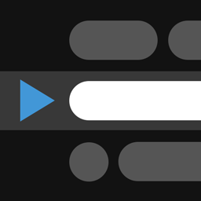

TelePrompter - Developer Setup
--

> Want to run this on your own server?  If you have a server running node v12+, here is all you need to do:




#### Clone Repo

```bash
git clone git@github.com:manifestinteractive/teleprompter.git
cd teleprompter
npm install
```

#### Start Client ( only needed for developers )

```bash
npm run client
```


#### Start Server ( for Remote - if needed )

```bash
npm start
```

#### Sample Nginx Config

```nginx
server {
  listen 80;
  listen [::]:80;
  server_name website.com www.website.com;
  return 301 https://$server_name$request_uri;
}

server {
  listen 443 ssl http2;
  listen [::]:443 ssl http2;
  include snippets/ssl-website.com.conf;
  include snippets/ssl-params.conf;
  include snippets/basic.conf;
  include snippets/error-pages.conf;

  add_header X-Frame-Options DENY;

  root /var/www/website.com/html;
  index index.php index.html index.htm index.nginx-debian.html;

  server_name website.com www.website.com;

  location / {
    try_files $uri $uri/ =404;
  }

  location ^~ /remote/ {
    proxy_set_header Upgrade $http_upgrade;
    proxy_set_header Connection "upgrade";
    proxy_set_header X-Forwarded-For $proxy_add_x_forwarded_for;
    proxy_set_header Host $host;
    proxy_http_version 1.1;
    proxy_pass http://localhost:3000/;
  }
}
```

#### Running as a Docker container

This project provides a development container which can be built from the local Dockerfile, as well as pre-built images on the [Github Container Registry](https://github.com/manifestinteractive/teleprompter/pkgs/container/teleprompter). You can use docker-compose to launch both TelePrompter's server and client containers.

```sh
docker compose build  # optional, if you have made code changes
docker compose up
```

These containers are good enough for development or use across a local network but are not hardened for production. If you intend to run them on the public Internet you should start by deploying them behind a reverse proxy as explained above

Automated Control
---

If you are feeling super fiesty, you can control the TelePrompter using the following Client Side Javascript:

```js
// Initialize TelePrompter ( happens on Page Load)
TelePrompter.init()

// Get Current Configuration for everything, or a specific property
TelePrompter.getConfig()
TelePrompter.getConfig('fontSize')

// Reset TelePrompter
TelePrompter.reset()

// Turn Dim On or Off
TelePrompter.setDim(true)
TelePrompter.setDim(false)

// Turn Flip X On or Off
TelePrompter.setFlipX(true)
TelePrompter.setFlipX(false)

// Turn Flip Y On or Off
TelePrompter.setFlipY(true)
TelePrompter.setFlipY(false)

// Set Font Size
TelePrompter.setFontSize(60)

// Set Page Speed
TelePrompter.setSpeed(30)

// Start TelePrompter
TelePrompter.start()

// Stop TelePrompter
TelePrompter.stop()

// Chain together commands
TelePrompter.setSpeed(30).setFontSize(60).start()

// Get Version Number
TelePrompter.version

// Enable / Disable Debugging ( `false` by default )
TelePrompter.setDebug(true)
TelePrompter.setDebug(false)
```
